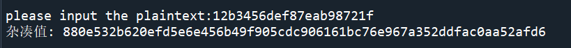
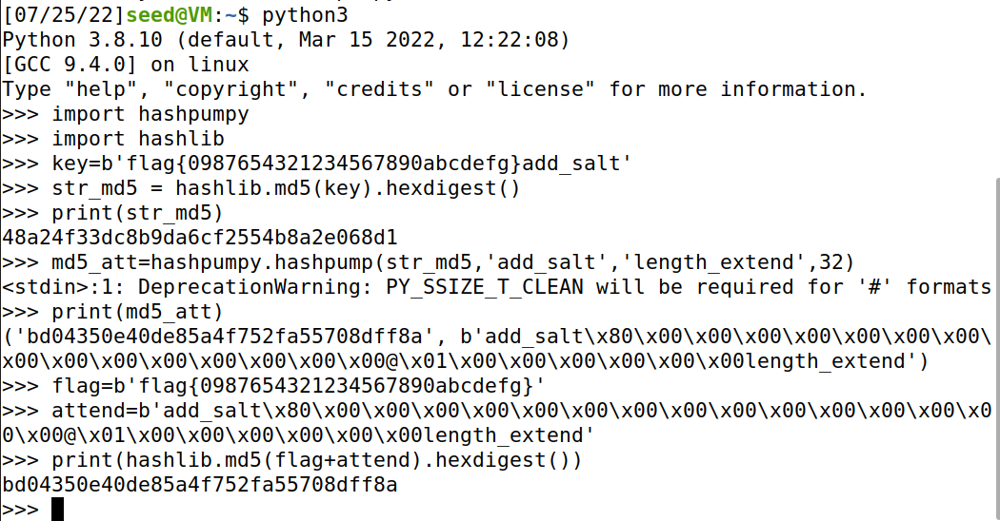

# Practice
Innovation and Entrepreneurship Practice 
所实现的项目 
===========
1.MD结构选择SM3实现基本生成杂凑值功能 
---
2.实现SM3的生日攻击 
---
3.实现MD5的中间相遇攻击 
---
4.实现SM2的基本加密解密功能 
---
5.实现SM2数字签名 
---
6.用python实现比特币并模拟进行交易 
---
7.实现构造默克尔树 
---
项目介绍 
=======
MD结构选择SM3实现基本生成杂凑值功能 
-----
代码运行效果如下图示：
 
please input the plaintext:12b3456def87eab98721f 
杂凑值: 880e532b620efd5e6e456b49f905cdc906161bc76e967a352ddfac0aa52afd6 
可见能正常生成杂凑值。 
SM3的生日攻击 
---
MD5的中间相遇攻击（虚拟机实现） 
---
 
